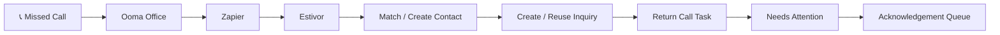
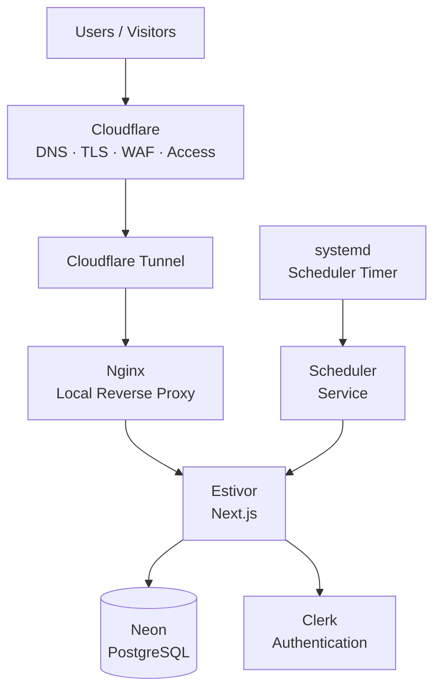
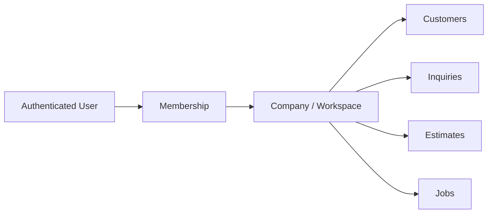
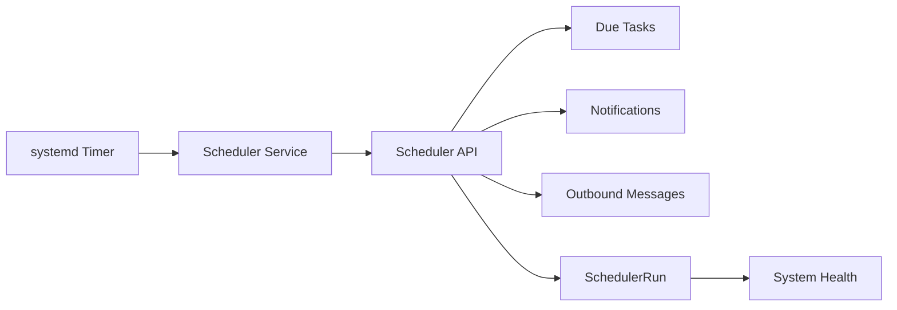
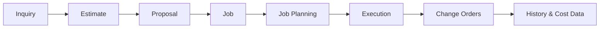

<div align="center">

<picture>
  <source media="(prefers-color-scheme: dark)" srcset="assets/logo-lockup-light.png">
  <source media="(prefers-color-scheme: light)" srcset="assets/logo-lockup.png">
  
</picture>

<br>

### Estimating, follow-up, and job workflow software for excavation contractors.

**From the first inquiry to the finished job.**

<br>

[](https://estivor.com)


</div>

<br>

<p align="center">
  
</p>

---

# What is Estivor?

**Estivor is an AI-assisted estimating and customer workflow platform built around the way small excavation contractors actually work.**

A contractor may start with:

- a phone call
- a few handwritten notes
- a photo
- a sketch
- a set of plans
- an old estimate
- or simply a description of the job

That information then needs to survive a much longer business process.

```text
Inquiry
   ↓
Customer
   ↓
Estimate
   ↓
Proposal
   ↓
Follow-up
   ↓
Accepted Work
   ↓
Job
   ↓
History
```

Most small contractors handle those stages across several disconnected tools.

Estivor brings them together into one focused workflow.

---

# The problem

Small excavation companies often run customer work through a combination of:

| Today | What happens |
|---|---|
| 📞 Phone calls | Leads and job details live in someone's memory |
| 💬 Text messages | Scope information gets scattered |
| 📧 Email | Follow-up becomes difficult to track |
| 📊 Spreadsheets | Pricing exists separately from customer history |
| 📄 Word / PDF estimates | Information has to be recreated later |
| 🧠 Memory | Important callbacks and next actions get missed |

Enterprise CRM and estimating platforms can solve parts of this problem.

But for a small contractor, they are often too broad, too complicated, or too disconnected from how the company actually works.

Estivor takes a different approach:

> **Keep the powerful workflow. Remove the unnecessary complexity.**

---

# From rough notes to a finished estimate

Estivor is designed around what the estimator already has.

The user can begin with job information, plans, notes, photos, measurements, or previous work.

Estivor then helps turn that information into a structured estimate.

<p align="center">
  
</p>

The workflow is designed around four steps:

### 1. Capture

Bring in the information already available.

### 2. Clarify

Identify what is known and ask only for information that is still required.

### 3. Price

Apply company rates, quantities, equipment, labour, materials, and assumptions.

### 4. Present

Generate the appropriate customer-facing estimate or proposal.

The objective is not to make contractors become software operators.

The objective is to make the software adapt to how they already estimate work.

---

# Branded customer documents

The estimate should look like it came from the contractor.

Not from Estivor.

<p align="center">
  
</p>

Company branding is configured once and carried into customer-facing documents.

This can include:

- company logo
- company name
- contact information
- brand colours
- document style
- estimate details
- scope
- exclusions
- assumptions
- pricing

The contractor's brand remains front and centre.

---

# One estimate. Different readers.

A homeowner and a general contractor do not need the same document.

Estivor separates the **estimate itself** from how that estimate is presented.

<p align="center">
  
</p>

| Audience | Presentation |
|---|---|
| **Homeowner** | Clear scope, grouped pricing, simple total |
| **Builder / GC** | Detailed scope, quantities, unit rates, assumptions and exclusions |
| **Commercial / Tender** | More formal bid structure and supporting information |

The pricing does not need to be recreated just because the reader changes.

---

# Company branding

Users can configure how their business appears on customer documents and preview the result.

<p align="center">
  
</p>

Estivor is intentionally designed to sit behind the contractor's business.

> **The customer should remember the contractor, not the estimating software.**

---

# The estimate is not the end of the workflow

An accepted estimate already contains valuable information:

- customer
- contact information
- scope
- quantities
- assumptions
- pricing
- notes
- job location
- exclusions
- equipment requirements

That information should not have to be recreated when the job begins.

<p align="center">
  
</p>

Estivor carries accepted work forward into the job lifecycle.

```text
Estimate
   ↓
Accepted
   ↓
Job
   ↓
Notes
   ↓
Next Actions
   ↓
History
```

This creates the foundation for future job planning and project execution tools.

---

# Follow-up matters as much as estimating

For many small contractors, the biggest sales problem is not getting another lead.

It is responding properly to the leads they already have.

Estivor includes a **Needs Attention** workflow for work such as:

- missed calls
- return-call tasks
- estimates awaiting follow-up
- overdue actions
- scheduled notifications
- customer communication
- job next steps

The goal is simple:

> Important work should become visible instead of depending on somebody remembering it.

---

# Real-world missed-call workflow

Estivor can receive phone events from a business phone system and turn them into actionable customer work.



A missed call can result in:

- the caller being matched to an existing contact
- a new contact being created when necessary
- an inquiry being created or reused
- a return-call task
- a Needs Attention item
- an outbound acknowledgement being queued
- activity being added to customer history

The integration is designed to be **idempotent**, so retries do not create duplicate work.

---

# Product architecture

Estivor is a working production application, not only a frontend prototype.



### Production stack

| Layer | Technology |
|---|---|
| Application | Next.js · React · TypeScript |
| Database | PostgreSQL · Neon |
| ORM | Prisma |
| Authentication | Clerk |
| Compute | DigitalOcean |
| Edge / Security | Cloudflare |
| Reverse Proxy | Nginx |
| Process Management | systemd |
| Testing | Vitest · Playwright |
| CI | Automated test and build pipeline |

---

# Security architecture

The production environment was intentionally designed to minimize exposed infrastructure.

```text
Internet
   ↓
Cloudflare
   ↓
Cloudflare Tunnel
   ↓
Local services only
```

The application origin does not need to expose normal application or administrative services directly to the public Internet.

Production controls include:

- Cloudflare Tunnel
- Cloudflare Access for administrative SSH access
- default-deny inbound firewall policy
- local-only application listeners
- production secrets stored outside the Git repository
- Clerk authentication
- server-side authorization
- company/workspace isolation
- scoped integration credentials
- environment validation
- scheduler health monitoring

---

# Multi-tenant application design

Estivor is designed as a multi-company SaaS application.

Authentication answers:

> **Who is this user?**

Estivor authorization answers:

> **Which company is this user allowed to access?**

Company membership is enforced separately from authentication so signing into Estivor does not automatically grant access to another company's data.



Workspace isolation is enforced server-side.

---

# Background processing

Estivor uses a recurring scheduler for work that should happen independently of a browser session.



The scheduler records a heartbeat in the application database.

That means a failed scheduler becomes visible instead of silently stopping for several weeks until somebody wonders why nothing has happened. A surprisingly popular software architecture pattern.

---

# Engineering behind the product

A large part of Estivor is not visible in screenshots.

The project includes work around:

### Application architecture

- multi-company tenancy
- customer and contact lifecycle
- inquiry/opportunity lifecycle
- estimate-to-job conversion
- activity history
- Needs Attention workflow
- notification queues
- outbound communication queues

### Integrations

- Ooma phone events
- Zapier intake
- workspace-scoped integration credentials
- phone normalization
- retry-safe processing
- idempotency

### Production operations

- database migrations
- environment validation
- hardened Linux deployment
- Cloudflare Tunnel
- Nginx reverse proxy
- systemd services
- scheduled background processing
- health monitoring
- production logging
- deployment runbooks
- recovery procedures

### Testing

- unit tests
- database integration tests
- concurrency tests
- Playwright browser tests
- CI build validation

---

# Technology

<div align="center">


</div>

---

# Why I built Estivor

Estivor grew from working directly with an excavation company and seeing how customer information moved through the business.

The company did not have a shortage of software options.

It had a shortage of software that fit the way the business actually operated.

Estimating, customer follow-up, phone calls, job information, and documents were spread across different systems and individual people.

The underlying idea behind Estivor became:

> **Take useful workflows that normally exist inside larger business systems, simplify them, and rebuild them around the needs of a specific industry.**

Excavation is the starting point.

---

# Where Estivor is going

The current product is focused around:

```text
INQUIRY
   ↓
ESTIMATE
   ↓
FOLLOW-UP
   ↓
ACCEPTED WORK
   ↓
JOB
```

The same information can eventually support a broader contractor operating system.

### Planned direction



Potential future areas include:

- job planning
- crew and equipment planning
- project execution
- change orders
- field notes
- photos
- customer communication
- historical costing
- operational reporting

The goal is not to add as many features as possible.

The goal is to eliminate duplicated work as information moves through the business.

---

# Project status

<table>
<tr>
<td><strong>Product</strong></td>
<td>Working production pilot</td>
</tr>

<tr>
<td><strong>Development</strong></td>
<td>Active</td>
</tr>

<tr>
<td><strong>Initial industry</strong></td>
<td>Excavation contractors</td>
</tr>

<tr>
<td><strong>Production source</strong></td>
<td>Private</td>
</tr>

<tr>
<td><strong>Public website</strong></td>
<td><a href="https://estivor.com">estivor.com</a></td>
</tr>
</table>

This repository is intentionally a **public product and engineering case study**.

The production application source code, deployment configuration, credentials, customer information, and operational documentation remain private.

---

<div align="center">

<br>

<picture>
  <source media="(prefers-color-scheme: dark)" srcset="assets/logo-lockup-light.png">
  <source media="(prefers-color-scheme: light)" srcset="assets/logo-lockup.png">
  
</picture>

### Built for the work between the first inquiry and the finished job.

**[Visit Estivor →](https://estivor.com)**

<br>

</div>
