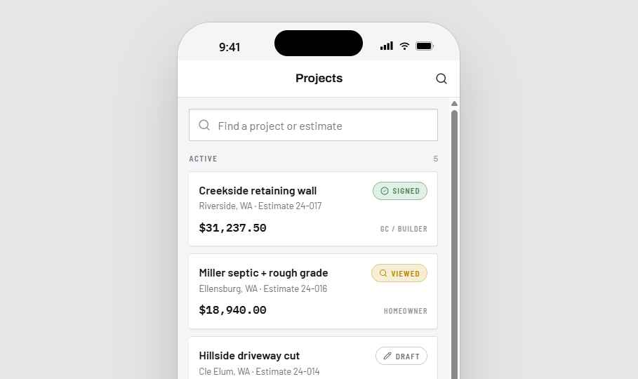
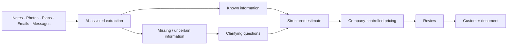
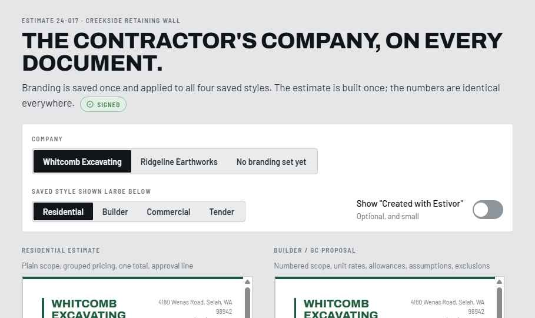
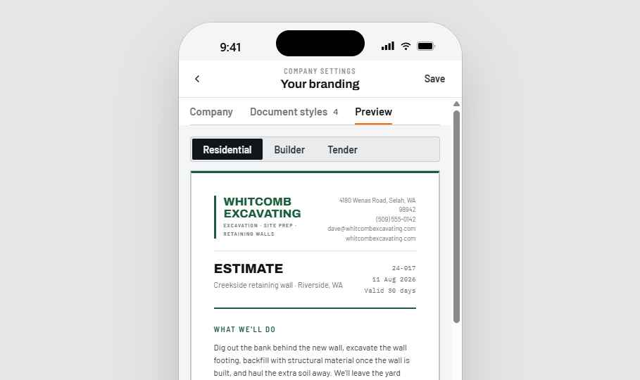
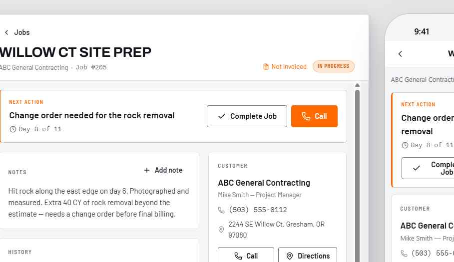
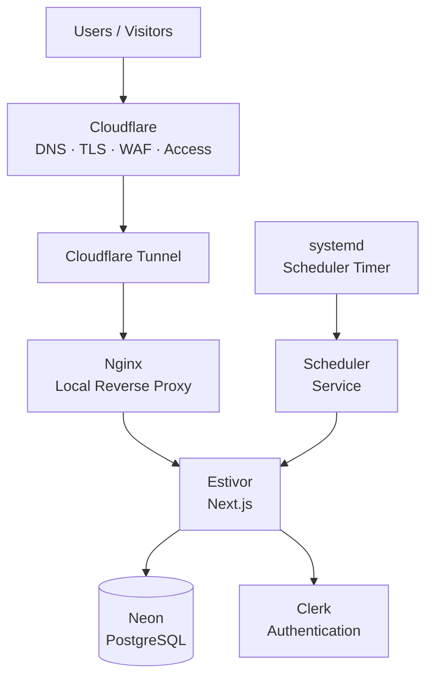
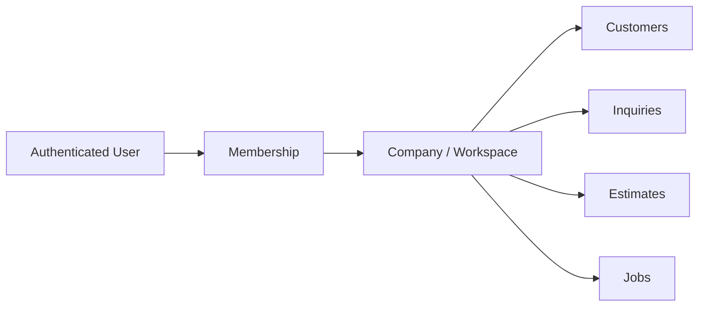
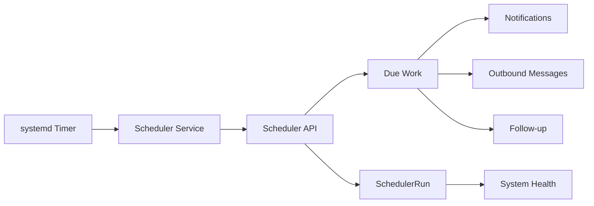
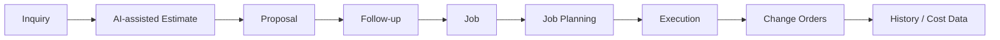

<div align="center">

<picture>
  <source media="(prefers-color-scheme: dark)" srcset="assets/logo-lockup-light.png">
  <source media="(prefers-color-scheme: light)" srcset="assets/logo-lockup.png">
  
</picture>

<br>

### AI-assisted estimating, follow-up, and job workflow software for excavation contractors.

**Turn rough job information into a structured estimate, identify what is missing, produce the right customer document, and carry accepted work into the job.**

<br>

[](https://estivor.com)


</div>

<br>

<p align="center">
  
</p>

---

# What is Estivor?

Estivor is an **AI-assisted estimating and customer workflow platform** being built around the way small excavation contractors actually work.

A contractor rarely starts with perfectly structured data.

A job might begin with:

- a phone call
- handwritten notes
- a text message
- photos from a site visit
- a sketch
- measurements
- a PDF plan
- an email from a builder
- an older estimate
- or a few rough sentences describing the work

Estivor is designed to take that messy starting point and help turn it into something useful.

```text
ROUGH JOB INFORMATION
        ↓
AI-ASSISTED EXTRACTION
        ↓
STRUCTURED JOB DETAILS
        ↓
CLARIFY WHAT IS MISSING
        ↓
PRICE USING COMPANY RATES
        ↓
REVIEW
        ↓
BRANDED ESTIMATE / PROPOSAL
        ↓
FOLLOW-UP
        ↓
ACCEPTED WORK
        ↓
JOB
        ↓
HISTORY
```

The goal is not to make contractors become CRM administrators.

The goal is to hide the complexity behind a workflow that feels natural.

---

# The core idea

Most business software expects the user to organize the information first.

Estivor tries to reverse that relationship.

> **Give Estivor what you have. Let the system help organize it.**

Instead of beginning with a long form full of empty fields, the estimator can begin with the information already available.

That could eventually mean:

```text
Upload notes
Upload photos
Upload plans
Paste an email
Enter rough measurements
Reuse an old estimate
Describe the job
        ↓
Estivor helps make sense of it
```

AI is used as an **interpretation and organization layer**, not as an uncontrolled decision-maker.

---

# How AI fits into the workflow

AI is most useful in Estivor before the estimate is fully structured.

That is where contractor information is usually incomplete, inconsistent, or buried inside documents and notes.



AI can assist with tasks such as:

- extracting useful text from uploaded notes and documents
- identifying customer and project information
- recognizing likely scope items
- finding quantities, dimensions, materials, and equipment references
- separating known information from assumptions
- identifying information that is still missing
- generating focused clarification questions
- organizing estimate line items
- drafting scope descriptions
- helping prepare assumptions and exclusions
- finding relevant information in previous estimates
- carrying estimate context into job planning

The important distinction is:

> **AI helps interpret the job. The company controls the business decisions.**

---

# AI does not invent the price

Estivor is not intended to ask an AI model:

> “What should this excavation cost?”

and blindly send whatever number comes back.

Pricing should come from company-controlled information such as:

- labour rates
- equipment rates
- trucking rates
- material costs
- disposal costs
- subcontractor costs
- production assumptions
- markup
- historical company data

The AI can help organize the estimate.

The contractor controls the numbers.

```text
AI
 └── helps understand the job

ESTIVOR
 └── structures the estimate

COMPANY RATE DATA
 └── determines the pricing

CONTRACTOR
 └── reviews and approves the result
```

That keeps the system useful without turning estimating into statistical roulette.

---

# From rough notes to a finished estimate

The estimator begins with whatever information already exists.

<p align="center">
  
</p>

The intended workflow has four main stages.

## 1. Capture

Bring in the information already available.

Examples:

- typed notes
- uploaded documents
- site photos
- measurements
- plans
- customer messages
- old estimates

## 2. Clarify

Estivor helps determine:

```text
What do we know?
What can we reasonably extract?
What is uncertain?
What is actually missing?
```

Instead of forcing the estimator through dozens of fields, Estivor can ask focused questions only where information is required.

## 3. Price

Once the scope is structured, Estivor applies company-controlled rates and costing.

The estimate can include:

- labour
- equipment
- materials
- trucking
- disposal
- subcontractors
- quantities
- allowances
- markup
- assumptions

## 4. Review & Present

The estimator reviews the result before anything goes to the customer.

Then Estivor produces the appropriate customer-facing document.

---

# One estimate. Different readers.

The numbers may be the same.

The reader is not.

A homeowner typically does not want the same document as a general contractor or commercial estimator.

<p align="center">
  
</p>

Estivor separates the underlying estimate from how it is presented.

| Audience | Presentation |
|---|---|
| **Homeowner** | Clear scope, grouped pricing, simple total |
| **Builder / GC** | Detailed scope, quantities, unit rates, assumptions and exclusions |
| **Commercial / Tender** | Formal bid structure and supporting detail |

That means:

```text
ONE ESTIMATE
    ↓
    ├── Homeowner document
    ├── Builder / GC proposal
    └── Commercial bid format
```

The estimator does not have to rebuild the job just because the reader changes.

---

# The contractor's brand stays front and centre

Estivor should disappear behind the contractor's business.

<p align="center">
  
</p>

Company branding can carry through the customer-facing documents:

- logo
- company name
- contact information
- brand colours
- document style
- scope
- assumptions
- exclusions
- pricing

The customer should remember the contractor.

Not the software that generated the PDF.

---

# Branding and document preview

Users can configure how their company appears on estimates and preview the document before sending it.

<p align="center">
  
</p>

Branding is configured once and reused throughout the workflow.

---

# Estivor is more than an estimate generator

The information used to create an estimate becomes more valuable after the estimate is accepted.

At that point Estivor already knows things such as:

- the customer
- project address
- scope
- quantities
- equipment
- materials
- assumptions
- exclusions
- notes
- pricing
- communications

Throwing that information away and starting over in another system makes little sense.

So the lifecycle continues.

<p align="center">
  
</p>

```text
INQUIRY
   ↓
ESTIMATE
   ↓
ACCEPTED
   ↓
JOB
   ↓
NOTES
   ↓
NEXT ACTIONS
   ↓
HISTORY
```

This creates the foundation for future job planning and execution features.

---

# Estimate → job planning

Once an estimate becomes a job, much of the planning information already exists.

Estivor can eventually help transform estimate information into an execution plan.

For example:

```text
Estimate says:
• 2 days excavator
• 1 day skid steer
• 8 loads export
• 4 loads granular
• drainage work
• final grading

                ↓

Potential job plan:

DAY 1
• mobilize excavator
• excavation
• load/export material

DAY 2
• finish excavation
• install drainage
• granular placement

DAY 3
• skid steer grading
• cleanup
• final site review
```

The point is not to have AI invent the construction plan.

The point is to reuse information the company already approved.

---

# Follow-up is part of the product

For many small contractors, the biggest sales problem is not getting another lead.

It is responding properly to the leads they already receive.

A missed call can disappear.

An estimate can sit for three weeks.

A callback can live entirely inside somebody's memory.

Estivor includes a **Needs Attention** workflow so important work becomes visible.

That can include:

- missed calls
- return-call tasks
- new inquiries
- estimates awaiting follow-up
- overdue actions
- customer communication
- scheduled reminders
- job next actions

```text
Something needs attention
        ↓
Estivor surfaces it
        ↓
User takes action
        ↓
Activity becomes part of the history
```

---

# Missed calls can become structured work

Estivor can receive events from a business phone system and turn them into actionable customer records.


A missed call can automatically result in:

- contact matching
- contact creation when necessary
- inquiry creation or reuse
- a return-call task
- a Needs Attention item
- an outbound acknowledgement
- activity added to customer history

The integration is designed to be **idempotent**, so retries do not create duplicate work.

---

# One connected customer history

The longer-term goal is for Estivor to maintain the useful history around a customer and their work.

```text
CUSTOMER
   │
   ├── Calls
   ├── Messages
   ├── Inquiries
   ├── Estimates
   ├── Follow-up
   ├── Jobs
   ├── Notes
   └── History
```

Instead of searching through email, phone history, spreadsheets, and old PDFs, the information stays connected to the customer.

---

# Product architecture

Estivor is deployed as a working production application rather than only a frontend prototype.



### Production stack

| Layer | Technology |
|---|---|
| Application | Next.js · React · TypeScript |
| Database | PostgreSQL · Neon |
| ORM | Prisma |
| Authentication | Clerk |
| Compute | DigitalOcean |
| Edge / Security | Cloudflare |
| Reverse Proxy | Nginx |
| Process Management | systemd |
| Testing | Vitest · Playwright |
| CI | Automated tests and builds |

---

# Security architecture

The production environment is intentionally designed to minimize exposed infrastructure.

```text
Internet
   ↓
Cloudflare
   ↓
Cloudflare Tunnel
   ↓
Local-only production services
```

Production controls include:

- Cloudflare Tunnel
- Cloudflare Access protecting administrative SSH access
- default-deny inbound firewall policy
- local-only application listeners
- production secrets stored outside the repository
- Clerk authentication
- server-side authorization
- company/workspace isolation
- scoped integration credentials
- production environment validation
- scheduler health monitoring

---

# Multi-company design

Estivor is designed as a multi-tenant SaaS product.

Authentication and authorization are intentionally separate.

```text
CLERK
Who is the user?

       ↓

ESTIVOR MEMBERSHIP
Which company can they access?

       ↓

WORKSPACE DATA
What records are they allowed to see?
```



A successful login does not automatically grant access to another company's information.

Workspace isolation is enforced server-side.

---

# Background processing

Some work needs to happen even when nobody has Estivor open in a browser.

Estivor uses a recurring production scheduler.



The scheduler records a heartbeat so the application can detect when background processing becomes stale.

Silent failures are considerably less charming once customers are involved.

---

# Engineering behind the product

A large amount of the engineering work is intentionally invisible to the end user.

## Application

- multi-company tenancy
- customer/contact lifecycle
- inquiry/opportunity lifecycle
- estimate workflow
- estimate-to-job conversion
- Needs Attention
- activity history
- notifications
- outbound communication queue
- scheduled work

## Integrations

- Ooma phone events
- Zapier intake
- workspace-scoped credentials
- phone normalization
- idempotent event handling
- retry-safe processing
- outbound SMS-ready architecture

## Production

- PostgreSQL migrations
- production environment validation
- hardened Linux deployment
- Cloudflare Tunnel
- Nginx reverse proxy
- systemd process management
- scheduled background processing
- system health monitoring
- deployment documentation
- recovery procedures

## Testing

- unit tests
- database integration tests
- concurrency tests
- browser tests
- CI validation

---

# Technology

<div align="center">


</div>

---

# Built vs. direction

Estivor is under active development, so it is useful to separate the working application from the broader product direction.

## Working product foundation

- customer/contact management
- inquiries
- estimates
- jobs
- Needs Attention
- estimate-to-job lifecycle
- activity history
- branded estimate documents
- multiple document audiences
- missed-call intake
- scheduled notifications/work
- multi-company architecture
- production deployment
- scheduler health monitoring

## AI-assisted estimating direction

The AI layer is being built to make the estimating workflow increasingly capable of working directly from unstructured contractor information.

This includes areas such as:

- uploaded notes
- PDF documents
- plans
- photos
- customer messages
- previous estimates
- text extraction
- information classification
- missing-information detection
- clarification questions
- estimate drafting
- scope language
- assumptions and exclusions

## Longer-term workflow



The goal is not to build every possible contractor feature.

The goal is to keep reusing information instead of making the business enter it again.

---

# Why I built Estivor

Estivor grew out of working directly with an excavation company and seeing how information actually moved through the business.

The company did not suffer from a lack of software products.

It suffered from information being spread across:

- phone calls
- texts
- emails
- spreadsheets
- estimate documents
- individual memory

Traditional CRM and operations systems can solve many of these problems.

But they often require the small contractor to adapt to the software.

Estivor explores the reverse idea:

> **Use AI, automation, and focused workflows to make powerful business systems usable without making the user understand the machinery underneath them.**

The contractor should not need to understand:

```text
CRM schemas
automation rules
workflow engines
document parsing
AI prompts
background jobs
integration APIs
```

They should be able to:

```text
Tell Estivor about the job
        ↓
Answer what is missing
        ↓
Review the estimate
        ↓
Send it
        ↓
Follow up
        ↓
Run the job
```

That is the product.

---

# Project status

<table>
<tr>
<td><strong>Product</strong></td>
<td>Working production pilot</td>
</tr>

<tr>
<td><strong>Development</strong></td>
<td>Active</td>
</tr>

<tr>
<td><strong>Initial industry</strong></td>
<td>Excavation contractors</td>
</tr>

<tr>
<td><strong>AI workflow</strong></td>
<td>Active product direction / staged implementation</td>
</tr>

<tr>
<td><strong>Production source</strong></td>
<td>Private</td>
</tr>

<tr>
<td><strong>Website</strong></td>
<td><a href="https://estivor.com">estivor.com</a></td>
</tr>
</table>

This repository is intentionally a **public product and engineering case study**.

The production source code, deployment configuration, credentials, operational documentation, and customer information remain private.

---

<div align="center">

<br>

<picture>
  <source media="(prefers-color-scheme: dark)" srcset="assets/logo-lockup-light.png">
  <source media="(prefers-color-scheme: light)" srcset="assets/logo-lockup.png">
  
</picture>

### Give Estivor what you know about the job.

### Let it help turn that information into the work that comes next.

**[Visit Estivor →](https://estivor.com)**

<br>

</div>
